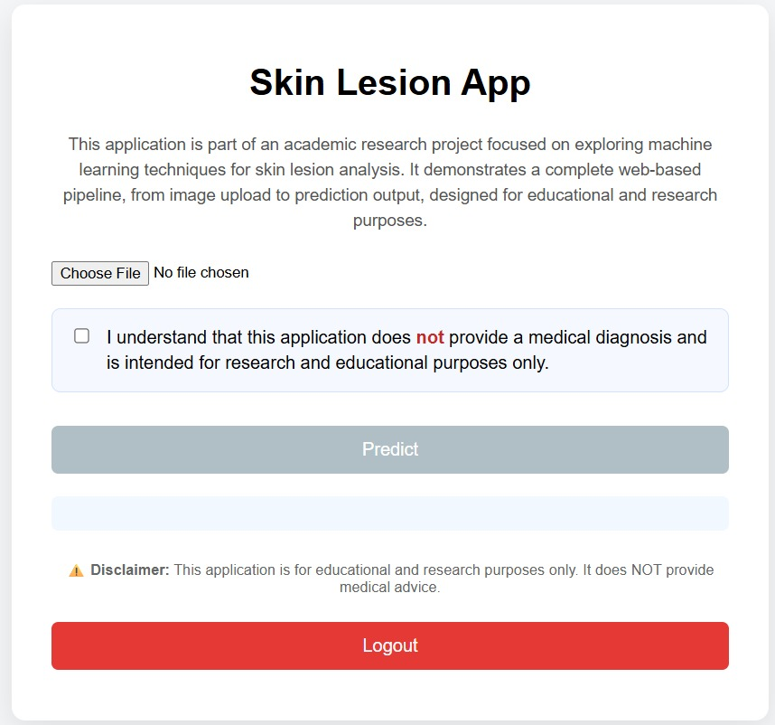

# Skin Cancer Detection Using Deep Learning

**Master’s Thesis Project**

End-to-end deep learning system for skin lesion classification using EfficientNet and real-world web deployment.

---

## Overview

Skin cancer is one of the most common forms of cancer worldwide, and early detection is critical for improving patient outcomes. This project presents a deep learning–based approach for automated skin lesion classification using dermoscopic images. The goal is to design a robust and clinically meaningful model and deploy it as a usable web application.

---

## Objectives

- Develop a convolutional neural network for skin lesion classification
- Compare EfficientNet-B0 and EfficientNet-B4 architectures
- Apply transfer learning using ImageNet weights
- Address class imbalance in medical datasets
- Evaluate models using clinically relevant metrics
- Deploy the trained model in a web-based application

---

## Dataset

- **Dataset name:** HAM10000 (Human Against Machine with 10,000 training images)
- **Type:** Dermoscopic skin lesion images
- **Task:** Binary classification
- **Classes:**
  - Benign
  - Malignant
- Publicly available dataset widely used in medical image analysis research

---

## Methodology

1. **Data Preprocessing**
   - Image resizing and normalization
   - Data augmentation techniques
   - Handling class imbalance using class weighting

2. **Model Architecture**
   - EfficientNet-B0 and EfficientNet-B4
   - Pretrained on ImageNet
   - Fine-tuning of top layers

3. **Training Strategy**
   - Binary cross-entropy loss
   - Adam optimizer
   - 30 training epochs
   - Custom decision threshold (not fixed at 0.5)

---

## Model Training

- Transfer learning with frozen base layers
- Gradual unfreezing during fine-tuning
- Monitoring validation loss and ROC–AUC
- Early stopping to reduce overfitting

---

## Evaluation Metrics

Due to the medical nature of the task, accuracy alone is not sufficient.

- **ROC–AUC:** Measures overall discriminative ability
- **Recall (Sensitivity):** Prioritized to reduce false negatives
- **Precision:** Evaluated as a trade-off metric
- **Confusion Matrix:** Used for error analysis

---

## Results

- EfficientNet-B4 achieved the best overall performance
- High ROC–AUC score indicating strong classification capability
- High recall ensuring minimal missed malignant cases
- Precision within an acceptable clinical range

### Model Performance Visualization

---

## Web Application

The trained model is deployed as a web application that allows users to upload a skin lesion image and receive a prediction.

- **Frontend:** HTML, CSS, JavaScript
- **Backend:** Node.js
- **Functionality:**
  - Image upload
  - Model inference
  - Prediction with confidence score

### Web Interface

---

## Project Structure
`
root/
├── notebooks/ # Data exploration, training, evaluation
├── backend/ # Node.js server
├── frontend/ # Web user interface
├── models/ # Trained models
├── images/ # Figures and screenshots
└── README.md
`

---

## Technologies Used

- Python
- TensorFlow / Keras
- EfficientNet
- Jupyter Notebook
- Node.js
- HTML, CSS, JavaScript

---

## Future Work

- Multi-class skin lesion classification
- Explainable AI methods (Grad-CAM)
- Clinical validation with expert feedback
- Mobile or cloud deployment

---

## Author

**Hana Bejaoui**  
Master’s Student in Computer Science  
Deep Learning | Medical AI | Computer Vision
